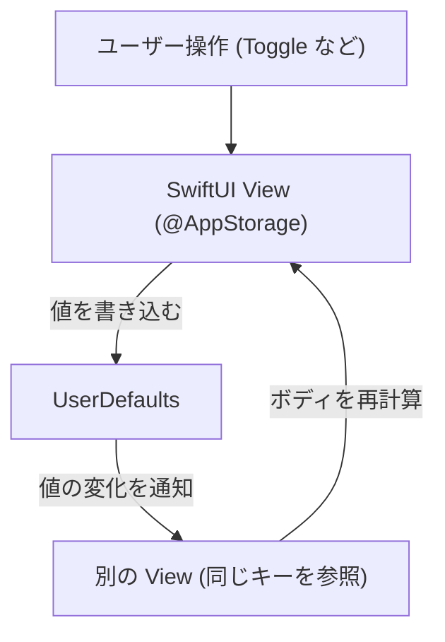

# AppStorage とは

SwiftUI の `@AppStorage` は、`UserDefaults` と同様の永続ストレージにユーザー設定や小さな値を保存しつつ、値の変化を自動的にビューへ反映してくれるプロパティラッパーです。`@State` のように宣言的に書けるため、フォームの入力内容やトグル設定などを簡潔に永続化できます。

## 特徴
- **自動同期**: 同じキーを参照する複数ビュー間で、値の更新が即座に共有されます。
- **永続化**: アプリ再起動後も `UserDefaults` に保存された値が利用されます。
- **宣言的 API**: `@State` や `@Environment` と同じく、プロパティラッパーで書けるため SwiftUI コードに自然に組み込めます。

## 仕組みイメージ


## 簡単な使い方
```swift
@AppStorage("isDarkMode") private var isDarkMode = false

var body: some View {
    Toggle("ダークモード", isOn: $isDarkMode)
}
```
`isDarkMode` は `UserDefaults` に保存され、他のビューで同じキーを `@AppStorage("isDarkMode")` として宣言すれば共有できます。
